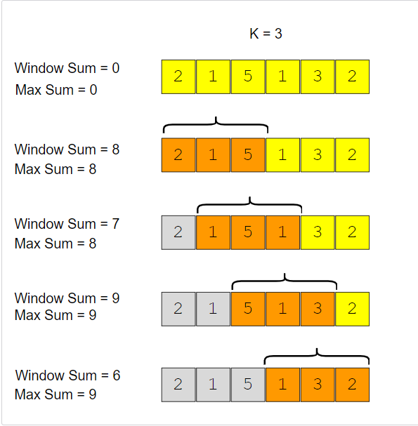
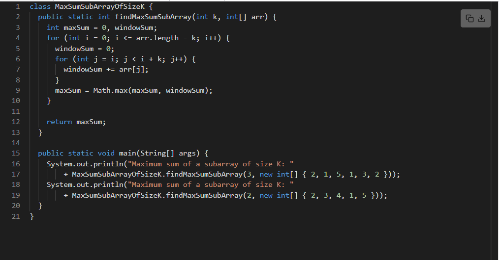

# Maximum Sum Subarray of Size K (easy)
Given an array of positive numbers and a positive number ‘k’, find the maximum sum of any contiguous subarray of size ‘k’.

Example 1:
```
Input: [2, 1, 5, 1, 3, 2], k=3 
Output: 9
Explanation: Subarray with maximum sum is [5, 1, 3].
```

Example 2:
```
Input: [2, 3, 4, 1, 5], k=2 
Output: 7
Explanation: Subarray with maximum sum is [3, 4].
```

## Solution
A basic brute force solution will be to calculate the sum of all ‘k’ sized subarrays of the given array, to find the subarray with the highest sum. We can start from every index of the given array and add the next ‘k’ elements to find the sum of the subarray. Following is the visual representation of this algorithm for Example-1:



Code:

