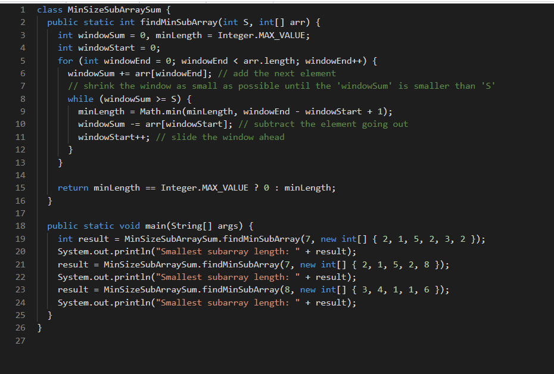

# Smallest Subarray with a given sum (easy)

Problem Statement #
Given an array of positive numbers and a positive number ‘S’, find the length of the smallest contiguous subarray whose sum is greater than or equal to ‘S’. Return 0, if no such subarray exists.

Example 1:
```
Input: [2, 1, 5, 2, 3, 2], S=7 
Output: 2
Explanation: The smallest subarray with a sum great than or equal to '7' is [5, 2].
```
Example 2:
```
Input: [2, 1, 5, 2, 8], S=7 
Output: 1
Explanation: The smallest subarray with a sum greater than or equal to '7' is [8].
```
Example 3:
```
Input: [3, 4, 1, 1, 6], S=8 
Output: 3
Explanation: Smallest subarrays with a sum greater than or equal to '8' are [3, 4, 1] or [1, 1, 6]
```

Solution:
- This problem follows the Sliding Window pattern and we can use a similar strategy as discussed in Maximum Sum Subarray of Size K. There is one difference though: in this problem, the size of the sliding window is not fixed. Here is how we will solve this problem:

- First, we will add-up elements from the beginning of the array until their sum becomes greater than or equal to ‘S’.
These elements will constitute our sliding window. We are asked to find the smallest such window having a sum greater than or equal to ‘S’. We will remember the length of this window as the smallest window so far.
- After this, we will keep adding one element in the sliding window (i.e. slide the window ahead), in a stepwise fashion.
- In each step, we will also try to shrink the window from the beginning. We will shrink the window until the window’s sum is smaller than ‘S’ again. This is needed as we intend to find the smallest window. This shrinking will also happen in multiple steps; in each step we will do two things:
- Check if the current window length is the smallest so far, and if so, remember its length.
- Subtract the first element of the window from the running sum to shrink the sliding window.

